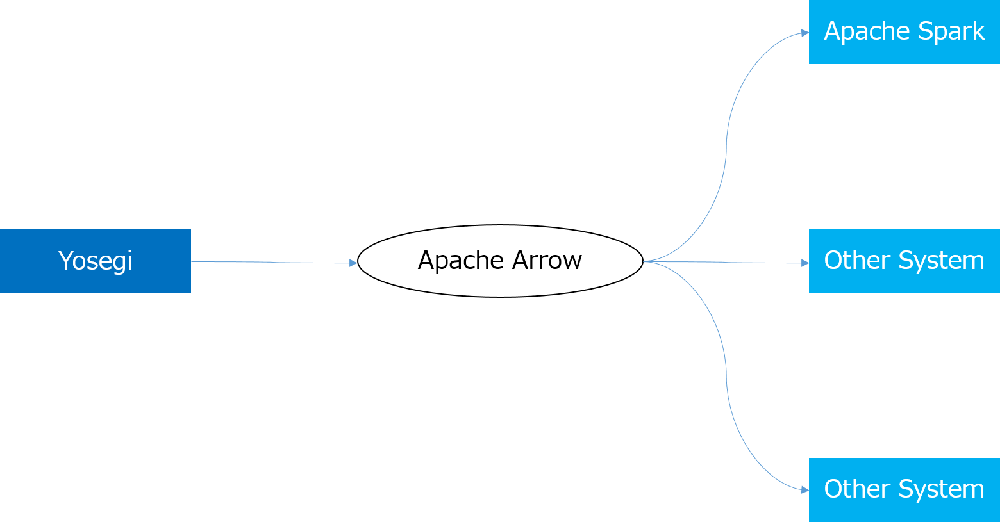

<!---
  Licensed under the Apache License, Version 2.0 (the "License");
  you may not use this file except in compliance with the License.
  You may obtain a copy of the License at

   http://www.apache.org/licenses/LICENSE-2.0

  Unless required by applicable law or agreed to in writing, software
  distributed under the License is distributed on an "AS IS" BASIS,
  WITHOUT WARRANTIES OR CONDITIONS OF ANY KIND, either express or implied.
  See the License for the specific language governing permissions and
  limitations under the License. See accompanying LICENSE file.
-->

# Support for Apache Arrow
[Apache Arrow](https://arrow.apache.org/) provides a common specification for exchanging data on memory.
As Yosegi also exchanges data with other OSS, it supports Apache Arrow.

# What does Yosegi support?

Provide I/O functions to Apache Arrow.
In reading, it provides the function to read from the file in the Apache Arrow format.
In writing, it provides the function to write from the Apache Arrow format to the Yosegi file.
Also, Yosegi is implemented in Java, so you can not read and write files directly in other languages.
Therefore, Yosegi supports by providing a command to create a file in Apache Arrow format.

Currently it does not support the function to create Yosegi files directly from other programming languages.

# Reading
Provides the function to read the Yosegi file with an array of ValueVector.

## Memory management
Apache Arrow has BufferAllocator for managing memory.
When creating a column, allocate memory from BufferAllocator.
Yosegi read unit is Spread. When reading the Yosegi file, create BufferAllocator with Reader and reset BufferAllocator when reading Spread.

## Reading schema
Since Yosegi does not have a schema, the schema may be different for each Spread.
Apache Arrow also does not need a schema when creating data structures.
However, since the schema to be read is decided in the query engine and the like, there are cases where an error occurs if the data structure and the schema are different.
When converting from Yosegi to Apache Arrow, support a function to read when schema to be read is decided and a function to read without schema.

## Reading column
The column is expressed as ValueVector.
ValueVector is prepared for each type of data.
When creating a ValueVector, if a schema is specified, create a ValueVector of the corresponding type.
If not specified, create it with the same data type as Yosegi column.
When setting data, ValueVector converts it to the expected object and sets the data.

# Writing

## Writing schema
Yosegi does not require schema information at the time of writing.
Write data with the data structure as it is.

## Conversion from ValueVector to Column
Since ValueVector is already the same information as column, it does not copy data to Column.
Yosegi prepares class with interface of IColumn and wraps ValueVector on that class.
This reduces processing costs associated with parsing data, so it is faster.
