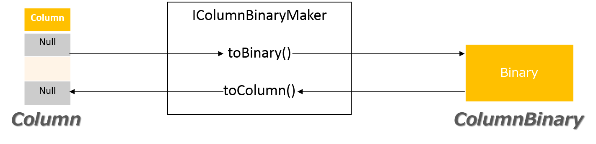

<!---
  Licensed under the Apache License, Version 2.0 (the "License");
  you may not use this file except in compliance with the License.
  You may obtain a copy of the License at

   http://www.apache.org/licenses/LICENSE-2.0

  Unless required by applicable law or agreed to in writing, software
  distributed under the License is distributed on an "AS IS" BASIS,
  WITHOUT WARRANTIES OR CONDITIONS OF ANY KIND, either express or implied.
  See the License for the specific language governing permissions and
  limitations under the License. See accompanying LICENSE file.
-->

# Overview of column binary

Spread of Yosegi's components is represented by a collection of columns.
Column is an object that implements the IColumn interface on memory.
In order to write to a file, it is necessary to mutually convert each column to binary.

There is IColumnBinaryMaker as an interface for converting.
You can add your own implementation by implementing interconversion interface.



# Class with column binary
ColumnBinary is a class that expresses the data structure in memory as binary.
This class has arrays of not only byte arrays but also statistical information, class information used for conversion, compression, and child ColumnBinary class.

```
  public final String makerClassName;

  public final String compressorClassName;

  public final String columnName;
  public final ColumnType columnType;
  public final int rowCount;
  public final int rawDataSize;
  public final int logicalDataSize;
  public final int cardinality;

  public int binaryStart;
  public int binaryLength;
  public byte[] binary;

  public List<ColumnBinary> columnBinaryList;
```

| variable | summary |
|:-----------|:------------|
| makerClassName  | Class name of IColumnBinaryMaker used for conversion  |
| compressorClassName | Class name used for compression  |
| columnName | Column name |
| columnType | Column type |
| rowCount | Number of elements in this column. |
| rawDataSize | Binary byte size. |
| logicalDataSize | Logical data size of this column.<br>[What is logical data size?](../statistics/data_size.md) |
| cardinality | Cardinality. Not required. If it can not be calculated, -1. |
| binaryStart | Starting position of byte array |
| binaryLength | The length of the byte array |
| binary | Byte array converted column to binary |
| columnBinaryList | Child's ColumnBinary. It is used for Struct and Array columns. If there is no child, it is an empty List or Null. |

# Interface of IColumnBinaryMaker

```
public interface IColumnBinaryMaker{

  ColumnBinary toBinary( final ColumnBinaryMakerConfig commonConfig , final ColumnBinaryMakerCustomConfigNode currentConfigNode , final IColumn column ) throws IOException;

  IColumn toColumn( final ColumnBinary columnBinary ) throws IOException;

  int calcBinarySize( final IColumnAnalizeResult analizeResult );

  void loadInMemoryStorage( final ColumnBinary columnBinary , final IMemoryAllocator allocator ) throws IOException;

  void setBlockIndexNode( final BlockIndexNode parentNode , final ColumnBinary columnBinary , final int spreadIndex ) throws IOException;

}
```

## toBinary()

This method converts columns that are data structures on memory to binary.

## toColumn()

This method converts from binary to column.

* columnBinary is a binary that should have been converted in this class.

## calcBinarySize()
This method calculates binary uncompressed size from column statistics.
This data size is used to determine the encoding rule.

## loadInMemoryStorage()
This method loads directly into the data structure of another column type.
Assigning data is done through the interface of IMemoryAllocator.

## setBlockIndexNode
This function sets the index of Predicate pushdown.
Since it is not required, this function does nothing if it does not have an index.

# Example

## A simple example of column encoding

```
  ColumnBinary toBinary( final ColumnBinaryMakerConfig commonConfig , final ColumnBinaryMakerCustomConfigNode currentConfigNode , final IColumn column ) throws IOException;
```

This section describes the implementation of toBinary().

In this example, it holds the information of the Int type column containing Null.
Therefore, the binary layout is a byte array representing the column length and NULL and a byte array of Int.
Conversion of Int to binary is done by using ByteBuffer.

```
    // Use common settings. If there is a setting unique to this column, use that setting.
    ColumnBinaryMakerConfig currentConfig = commonConfig;
    if( currentConfigNode != null ){
      currentConfig = currentConfigNode.getCurrentConfig();
    }
```

This code has selected the setting to adapt. If there is a setting unique to this column, this class adopts that setting.If there is not, this class adopts common setting.

This setting will be passed from Writer when converting Spread.

```
    // Calculate buffer size from column size.
    // In this example, 0 and 1 are represented by bytes in the expression of NULL.
    // Therefore, the buffer size is the sum of the byte size used to represent NULL and the Int byte size represe
nting Int and the number of columns.
    int nullByteLength = column.size() * Byte.BYTES;
    int intBinaryLength = column.size() * Integer.BYTES;
    byte[] buffer = new byte[ Integer.BYTES + nullByteLength + intBinaryLength ];

    // Substitute numeric and NULL information into buffer
    ByteBuffer.wrap( buffer , 0 , Integer.BYTES ).putInt( column.size() );
    ByteBuffer nullBuffer = ByteBuffer.wrap( buffer , Integer.BYTES , column.size() );
    ByteBuffer intBuffer = ByteBuffer.wrap( buffer , Integer.BYTES + nullByteLength , intBinaryLength );
    int rows = 0;
    for( int i = 0 ; i < column.size() ; i++ ){
      ICell cell = column.get(i);
      if( cell.getType() == ColumnType.NULL ){
        nullBuffer.put( (byte)1 );
        intBuffer.putInt( 0 );
      }
      else{
        nullBuffer.put( (byte)0 );
        int num = ( (PrimitiveCell)cell ).getRow().getInt();
        intBuffer.putInt( num );
        rows++;
      }
    }
```
Calculate the buffer size from the column size beforehand and create a byte array.
It then loops by the size of the column and retrieves the data from the column.

Get Cell from the column and insert 1 into the null buffer offset if the column type is NULL.
Otherwise, we will get the data in the Int type and insert it into the offset of the Int type buffer.

In this example we implement an implementation that does not contain unintended columns, but you may want to check if it is Int column type strictly.

```
    // Compress buffer
    byte[] compressBinary = currentConfig.compressorClass.compress( buffer , 0 , buffer.length );
```

About compression can be obtained from setting.
It is possible to ignore this setting, but you should not.

```
    // Create a new ColumnBinary
    return new ColumnBinary(
      this.getClass().getName(),
      currentConfig.compressorClass.getClass().getName(),
      column.getColumnName(),
      ColumnType.INTEGER,
      rows,
      compressBinary.length,
      intBinaryLength,
      -1,
      compressBinary,
      0,
      compressBinary.length,
      null
    );
```
Create a ColumnBinary.
The returned object is included in toBinary () as an argument.

## A simple example of column decoding

```
IColumn toColumn( final ColumnBinary columnBinary ) throws IOException;
```

This section describes the implementation of toClumn().

Convert binary to Yosegi column objects.
In this example, PrimitiveColumn is used, but in case of seeking performance etc., delay processing and light column mounting etc are required.
Please refer to the implementation included below common if performance is required.

```
    // Decompress binary
    ICompressor compressor = FindCompressor.get( columnBinary.compressorClassName );
    byte[] binary = compressor.decompress( columnBinary.binary , columnBinary.binaryStart , columnBinary.binaryLength );
```

The class for decompressing has a class name in ColumnBinary.
I will get a class to do decompress with Util.
Use this class to decompress binary byte arrays from ColumnBinary.

```
    int columnSize = ByteBuffer.wrap( binary ).getInt();
    int nullByteLength = Byte.BYTES * columnSize;
    int intBinaryLength = Integer.BYTES * columnSize;
    ByteBuffer nullBuffer = ByteBuffer.wrap( binary , Integer.BYTES , nullByteLength );
    ByteBuffer intBuffer = ByteBuffer.wrap( binary , Integer.BYTES + nullByteLength , intBinaryLength );

    // Column creation and data set.
    IColumn column = new PrimitiveColumn( ColumnType.INTEGER , columnBinary.columnName );
    for( int i = 0 ; i < columnSize ; i++ ){
      byte isNull = nullBuffer.get();
      int number = intBuffer.getInt();
      if( isNull == (byte)0 ){
        column.add( ColumnType.INTEGER , new IntegerObj( number ) , i );
      }
    }
    return column;
```

It converts from binary to Int and adds it to Column only when the byte which holds null is 0.

## A simple example of in-memory loading

```
  void loadInMemoryStorage( final ColumnBinary columnBinary , final IMemoryAllocator allocator ) throws IOException;
```

This section describes the implementation of loadInMemoryStorage().
Skip the same process as toColumn.

```
    // Load data structure using IMemoryAllocator.
    for( int i = 0 ; i < columnSize ; i++ ){
      byte isNull = nullBuffer.get();
      int number = intBuffer.getInt();
      if( isNull == (byte)0 ){
        allocator.setInteger( i , number );
      }
      else{
        allocator.setNull( i );
      }
    }
```

The point different from toColumn is to set data using API of allocator.
Since this column is Int type, we use setInteger ().
Because the allocator is an interface, if you guarantee to call the same set as the type of the column, you do not have to guarantee whether it is added to the data structure held by the allocator.

```
    // Finally, set the size of the column. Load processing needs to fill in NULL value.
    allocator.setValueCount( columnSize );
```
The allocator must set the column size at the end.
The allocator does not know the column size.
For example, allocator substitutes Null using column size.
